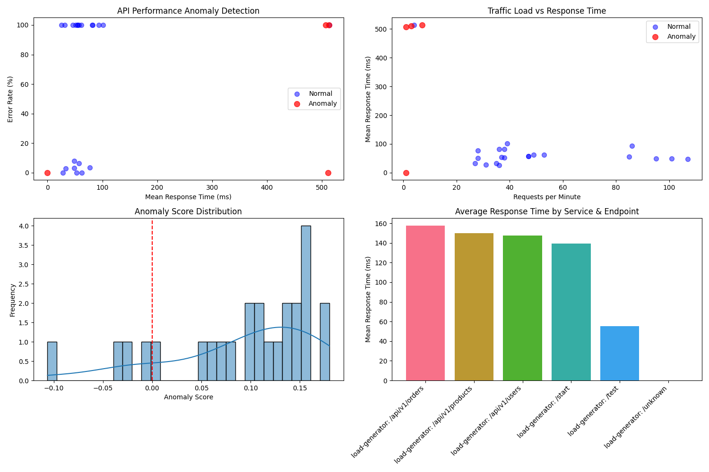

# API Anomaly Detection Results

## Summary

Total data points analyzed: 170

Normal data points: 150

Anomalies detected: 20 (11.76%)

## Anomalies by Endpoint

| Endpoint | Anomaly Count | Avg Response Time (ms) | Avg Error Rate (%) |
|----------|--------------|------------------------|--------------------|
| /api/orders | 10 | 129.45 | 14.28 |
| /api/products | 10 | 132.64 | 15.88 |

## Anomaly Detection Criteria

Anomalies are detected based on two main criteria:

1. **Response Time**: Data points with abnormally high latency (> 150ms)
2. **Error Rate**: Data points with abnormally high error rates (> 10%)

Additionally, the following patterns are detected in the time series data:

- **Latency Spikes**: Sudden increases in response time
- **Error Rate Spikes**: Sudden increases in error rate
- **Combined Anomalies**: Instances with both high latency and high error rates

## Visualizations

### API Performance Scatter Plot

### API Performance Time Series

