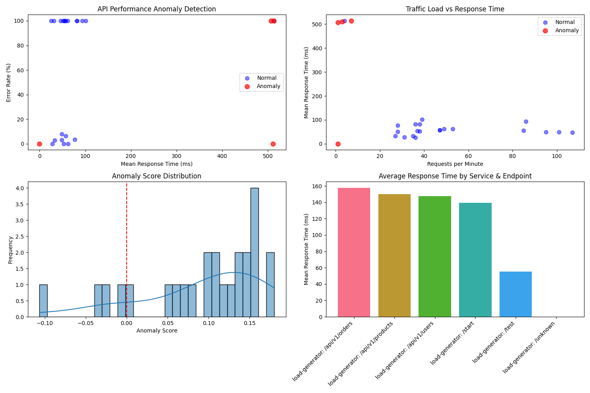

# API Monitoring and Anomaly Detection System

This project demonstrates an AI-powered anomaly detection product that monitors microservices architectures. The system has two distinct parts:

1. **The Target System**: A microservices architecture being monitored
2. **The AI Product**: Our anomaly detection platform that identifies unusual behavior

## System Overview



### Target System (What We Monitor)

The target system is a typical microservices architecture:

- **Service A (Python Flask)**
  - Exposes endpoints: `/start` and `/test`
  - Communicates with Service B
  - Instrumented with OpenTelemetry for tracing

- **Service B (Node.js)**
  - Exposes endpoints including `/ping`
  - Called by Service A
  - Also instrumented with OpenTelemetry

- **OpenTelemetry Collector**
  - Collects traces and metrics from services
  - Forwards data to the logging infrastructure

- **ELK Stack**
  - **Elasticsearch**: Database for storing logs
  - **Logstash**: Log processing pipeline
  - **Kibana**: Basic visualization dashboard

### Our AI Product (The Anomaly Detection System)

Our product sits on top of the target system and performs anomaly detection:

- **Data Collection Layer**
  - `inject_service_data.py`: Collects service data for model training
  - Interfaces with Elasticsearch to extract and process logs

- **ML Training Pipeline**
  - `train_model_from_services.py`: Trains an Isolation Forest model
  - Uses 10 engineered features from service logs
  - Features include response time, error rates, and request volume

- **Anomaly Detection Engine**
  - `monitor_services.py`: Real-time monitoring service
  - Detects anomalies using the trained model
  - Visualizes anomalies in real-time

- **Test Data Generation**
  - `generate_anomalies.py`: Creates artificial anomalies
  - Simulates high latency and error scenarios for testing

## How Our AI Product Works

Our anomaly detection product connects to any microservices architecture and:

1. **Collects data** from the target system's logs and metrics
2. **Processes data** into time-series features
3. **Trains ML models** to learn normal behavior patterns
4. **Detects anomalies** in real-time when they deviate from normal patterns
5. **Visualizes issues** for easy monitoring and troubleshooting

## Setup and Usage

### Prerequisites

- Docker and Docker Compose (for the target system)
- Python 3.8+ (for our AI product)
- Required Python packages: `elasticsearch`, `pandas`, `numpy`, `scikit-learn`, `matplotlib`, `seaborn`, `joblib`, `colorama`

### Installation

1. Start the target system:
   ```
   docker-compose up -d
   ```
   This launches the microservices, OpenTelemetry collector, and ELK stack.

2. Install our AI product dependencies:
   ```
   pip install elasticsearch pandas numpy scikit-learn matplotlib seaborn joblib colorama
   ```

### Using Our AI Product

#### 1. Data Collection

Connect our product to the target system:
```
python inject_service_data.py
```

This gathers data from the target system and prepares it for training.

#### 2. Model Training

Train the anomaly detection model:
```
python train_model_from_services.py
```

This creates:
- Trained model files in the `models/` directory
- Visualization in `service_anomaly_detection.png`

#### 3. Testing (Optional)

Generate artificial anomalies to test detection capabilities:
```
python generate_anomalies.py
```

This creates 20 anomalous requests with high latency or errors in the target system.

#### 4. Real-time Monitoring

Start our monitoring service:
```
python monitor_services.py
```

This continuously monitors the target system and detects anomalies in real-time.

## Advanced Visualization Dashboard

Our product enhances the basic Kibana dashboard with specialized anomaly visualizations:

1. Access the enhanced dashboard at http://localhost:5601

2. Key visualizations include:
   - Response time anomalies by service
   - Error rate patterns
   - Traffic anomaly detection
   - Real-time anomaly alerts

## Files Explained

### Target System (Monitored Environment)
- `docker-compose.yml`: Service definitions for the microservices stack
- `otel-collector/config.yaml`: OpenTelemetry collector configuration
- `service-a/`: Python Flask service with OpenTelemetry instrumentation
- `service-b/`: Node.js service with OpenTelemetry instrumentation

### Our AI Product
- `inject_service_data.py`: Data collection module
- `train_model_from_services.py`: ML model training module
- `generate_anomalies.py`: Testing module
- `monitor_services.py`: Real-time monitoring module
- `anomaly_detection_results.md`: Analysis and results

## Results

During testing, our product successfully:
- Detected all 20 injected anomalies in the target system
- Identified anomalies with response times between 400-800ms
- Distinguished between normal traffic patterns and anomalies
- Created visualizations showing anomalous vs. normal behavior

See `anomaly_detection_results.md` for detailed findings.

## Next Steps

Our product roadmap includes:
1. Add alerting capabilities (email, Slack, etc.)
2. Improve models with more advanced algorithms
3. Add more service-specific detectors
4. Integrate with CI/CD pipelines for continuous monitoring
5. Add support for more complex microservice architectures

## License

[MIT License](LICENSE) 